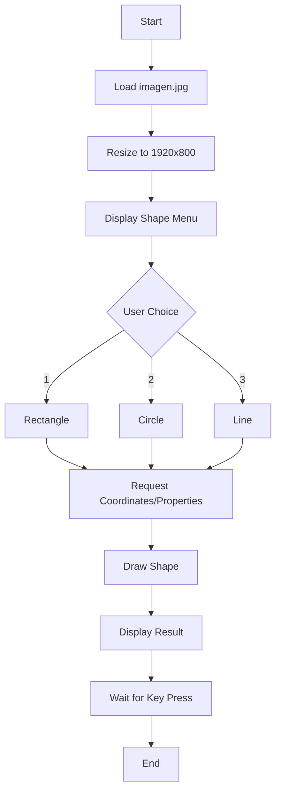

# OpenCV Shape Drawing Tool

## Overview

This Python tool allows users to draw geometric shapes (rectangles, circles, and lines) on images using OpenCV with customizable properties. The program features an interactive console interface for easy shape configuration and immediate visualization.

## Features

- **Shape Options**:
  - Rectangle
  - Circle
  - Line

- **Customization**:
  - Precise coordinate positioning
  - Color selection (BGR color space)
  - Adjustable line thickness
  - Fill option (using thickness = -1)

- **User Experience**:
  - Interactive console prompts
  - Real-time preview
  - Input validation

## Installation

1. Ensure you have Python 3.12 installed
2. Install OpenCV:
   ```bash
   pip install opencv-python
   ```

## Usage

1. **Prepare Your Image**:
   - Place an image named `imagen.jpg` in the same directory as the script
   - The image will be automatically resized to 1920×800 pixels

2. **Run the Program**:
   ```bash
   python Draw_figure.py
   ```

3. **Follow the Prompts**:
   - Select shape type (1-3)
   - Enter coordinates (see coordinate system below)
   - Specify color values (0-255 for each BGR component)
   - Set thickness (positive number for outline, -1 for fill)

4. **View Results**:
   - The modified image displays in a new window
   - Press any key to close the window and exit

## Coordinate System

The image dimensions are 1920 (width) × 800 (height) pixels:

- **X-axis**: Horizontal (0 to 1920)
- **Y-axis**: Vertical (0 to 800)

Key reference points:
- Top-left corner: (0, 0)
- Center: (960, 400)
- Bottom-right corner: (1920, 800)

## Code Structure

The program uses an object-oriented design with the `figure` class that handles all shape drawing operations.

### Main Components:
- **Initialization**: Loads and resizes the image
- **User Interface**: Console-based menu system
- **Drawing Methods**:
  - `draw_rectangle()`
  - `draw_circle()`
  - `draw_line()`

## Examples

### Drawing a Red Filled Circle at Center:
```
Choose shape:
1. Rectangle
2. Circle
3. Line
Enter your choice: 2

Enter x coordinate (0-1920): 960
Enter y coordinate (0-800): 400
Enter radius: 100
Enter blue value (0-255): 0
Enter green value (0-255): 0
Enter red value (0-255): 255
Enter thickness (-1 for fill): -1
```

## Notes

- The original image file is not modified - changes are only displayed temporarily
- For best results, use high-resolution source images
- Color values follow BGR (Blue, Green, Red) order
- Negative thickness fills shapes completely

## Program Flow



## Troubleshooting

- If the program fails to start:
  - Verify `imagen.jpg` exists in the same directory
  - Check OpenCV is installed correctly
- If shapes don't appear:
  - Confirm coordinates are within image bounds
  - Verify thickness isn't set to 0

## Future Improvements

- Add support for multiple shapes per session
- Implement image saving functionality
- Add polygon drawing option
- Create graphical user interface
